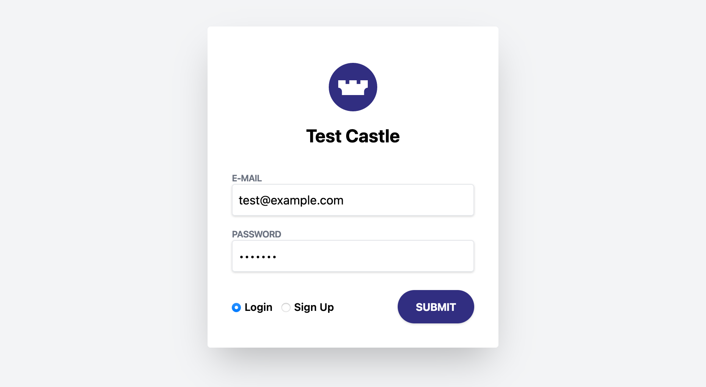

# Castle Demo Ruby App



A demo app to show off the capabilities of Castle [Filter and Risk APIs](https://reference.castle.io/#tag/risk_assessment).
Castle APIs help developers prevent new account abuse, account takeovers, and transaction fraud.

Create a free account and get API keys at: [dashboard.castle.io/signup/new](https://dashboard.castle.io/signup/new)

## Getting up and running

> This app requires [Ruby 3.0.1](https://www.ruby-lang.org/en/) to be installed.

```bash
bundle install

CASTLE_API_SECRET=your_secret CASTLE_PUB_KEY=pk_your_key bundle exec ruby app.rb
```

Navigate to [localhost:4567](http://localhost:4567) to test the Risk ans Filter endpoints. The results will show up in the [Castle Dashboard](https://dashboard.castle.io)

## License

MIT License

http://www.opensource.org/licenses/mit-license
